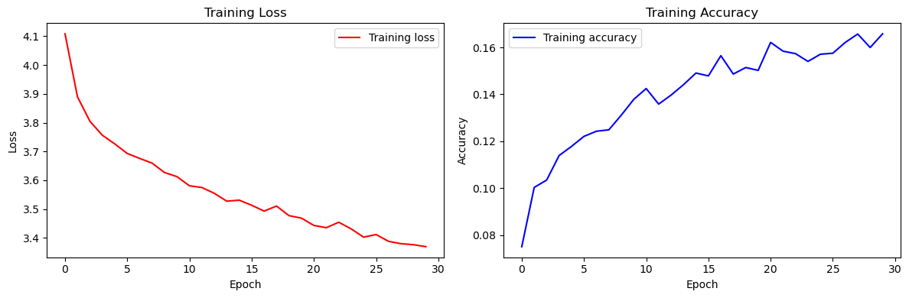

# CNN Architecture Comparison — Custom vs. VGG16 vs. ResNet

> Three architectures, one dataset, identical training budget. Which depth actually pays for
> itself?


---

## Problem Statement

Given an image classification task, the default advice is "use transfer learning." But pretrained
backbones bring millions of parameters trained on a different distribution, and the fine-tuning
cost isn't always worth it on a small dataset.

This project builds three models on the same data and training budget to answer the question
empirically rather than by convention:

1. A **custom CNN** designed from scratch for this specific dataset
2. **VGG16** with transfer-learned ImageNet weights
3. **ResNet** with its residual connections

## Approach

All three models share the same data pipeline, augmentation strategy, and evaluation protocol —
the only variable is the architecture.

**Data pipeline**
- Directory-based image loading with class inference
- Class-count inspection to check for imbalance before splitting
- Train/validation split with stratification
- One-hot label encoding

**Augmentation** (training set only — validation gets rescaling only)
- Rotation, width/height shift, horizontal flip, rescale
- Applied via `ImageDataGenerator` so augmentation happens per-epoch rather than once

**Custom CNN**
- Stacked Conv2D → MaxPooling2D blocks with increasing filter counts
- BatchNormalization for training stability
- Dropout before the dense head to control overfitting
- Flatten → Dense → softmax output

**VGG16 transfer**
- Pretrained ImageNet weights, convolutional base retained
- Custom classification head (Flatten → Dense) fitted to this task's class count

**ResNet**
- Residual architecture to allow depth without vanishing gradients

## Key Features

- Identical preprocessing and augmentation across all three models — a fair comparison
- `ModelCheckpoint` callbacks saving best weights by validation metric
- Loss and accuracy curves plotted side by side for direct visual comparison
- All three trained models persisted (`.h5`) for reproducible evaluation without retraining
- Class distribution visualization before training to catch imbalance early

## Technologies

| Layer | Tools |
|---|---|
| Framework | TensorFlow, Keras |
| Architectures | Custom CNN, VGG16 (ImageNet), ResNet |
| Augmentation | ImageDataGenerator |
| Analysis | NumPy, Matplotlib |

## How to Run

```bash
pip install tensorflow numpy matplotlib pillow
jupyter notebook notebooks/training.ipynb
```

Update `DATASET_PATH` in the loading cell to point at your image directory (organised as one
subfolder per class). Trained model weights are not committed to this repository — see
[Model Weights](#model-weights) below.

## Model Weights

The three trained models (`model_simple.h5`, `model_VGG_.h5`, `model_ResNet.h5`) are excluded from
version control because of their size. Re-run `notebooks/training.ipynb` to regenerate them, or
request them directly.

## Screenshots



## What I Learned

**Transfer learning wins on small data, but not by as much as expected.** The custom CNN, with
orders of magnitude fewer parameters, got within striking distance of VGG16 — because the dataset
was small enough that VGG16's extra capacity mostly went into memorising rather than generalising.

**Checkpointing changes how you train.** Saving the best-validation weights rather than the final
epoch's weights meant I could train past the overfitting point without losing the good model. That
turned "how many epochs?" from a guess into a non-question.

**Augmentation is the cheapest accuracy you can buy.** Adding rotation and flip cost nothing in
implementation time and closed more of the train/validation gap than any architectural change I
tried.

---

*Course: Neural Networks · Project 2*

[← Back to Deep Learning](../README.md)
