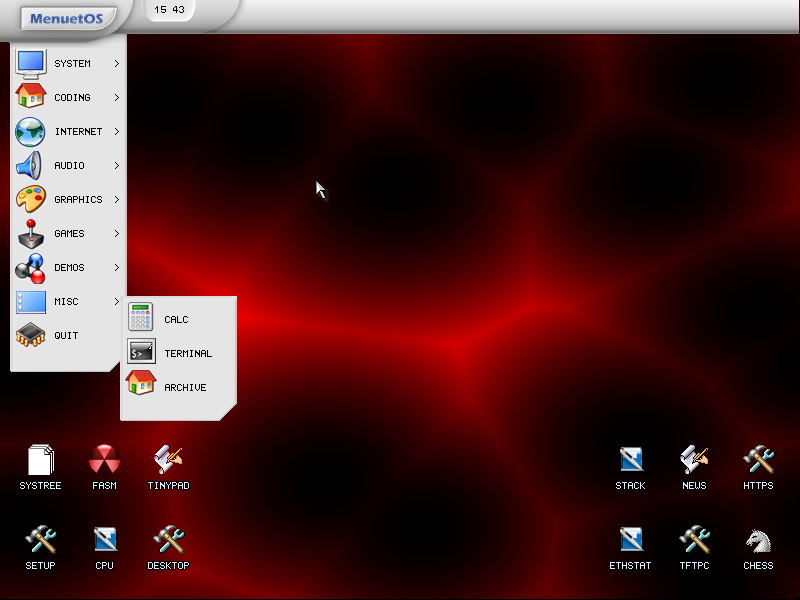

# MenuetOS Architecture Analysis

> A four-part technical study of an operating system written entirely in x86 assembly that fits on
> a single floppy disk.


---

## Problem Statement

Operating systems courses teach concepts against Linux or Windows — systems far too large to read.
[MenuetOS](https://www.menuetos.net/) is different: a pre-emptive, multitasking, GUI-equipped
operating system written from scratch in 100% x86 assembly, small enough that a student can
actually read its source.

This study examines four subsystems, comparing MenuetOS's implementation against the general
approaches taught in the course.

## Documents

### 1. Memory Management
How MenuetOS allocates, tracks, and reclaims physical and virtual memory — and how the design
differs from a general-purpose OS given the size constraint.

### 2. Deadlock Handling
The four Coffman conditions, and MenuetOS's position on prevention, avoidance, detection, and
recovery.

### 3. File System
On-disk layout, directory structure, allocation strategy, and the trade-offs the design makes.

### 4. System Call Interface
The syscall mechanism, the user/kernel boundary, and how applications request kernel services in an
assembly-native system.

## Key Findings

**Constraints produce clarity.** Fitting a full multitasking GUI OS in ~1.44MB forces every
subsystem to be minimal and legible. The memory manager is comprehensible in an afternoon —
Linux's is not.

**Assembly is a design decision, not just an implementation one.** Writing an entire OS in assembly
removes the C runtime, the compiler's abstractions, and any portability layer. What's left is a
direct relationship between the code and the hardware.

**Small systems teach concepts that large ones obscure.** The system call path in MenuetOS is short
enough to trace end to end. That's not true of any production kernel, and it's precisely why the
concept is easier to learn here.

## Contents

```
menuetos-architecture-analysis/
├── README.md
└── docs/
    ├── memory-management.pdf
    ├── deadlock-handling.pdf
    ├── file-system.pdf
    ├── system-calls.pdf
    └── menuet-documentation.pdf     ← combined overview
```

## Screenshots



## References

- [MenuetOS official site](https://www.menuetos.net/)
- Course material: Operating Systems, Year 2

---

*Course: Operating Systems · Documentation project*

[← Back to Operating Systems](../README.md)
