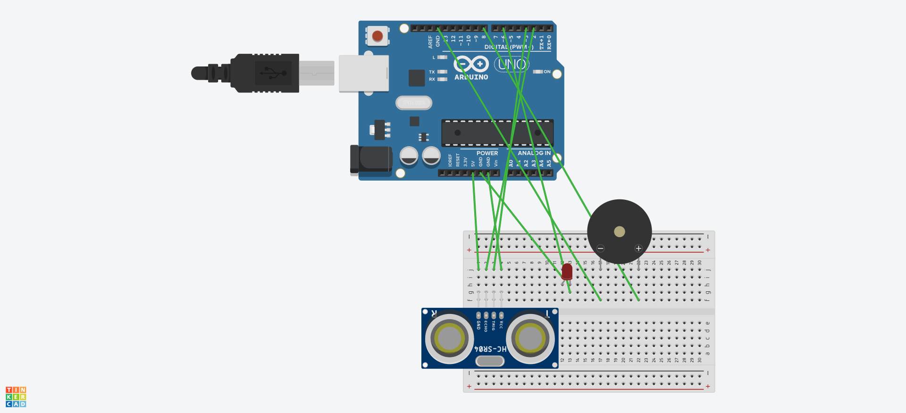

# Critical Distance Detection System

> An ultrasonic proximity alarm — where the "dataset" is physics and the feedback loop is
> immediate.


---

## Problem Statement

Detect when an object crosses a configurable critical distance threshold and trigger an alert.

The application is collision avoidance — parking sensors, robot obstacle detection, industrial
safety cutoffs. The engineering interest is that unlike a software project, the input is a noisy
physical measurement and there's no way to rerun it on cached data.

## How It Works

An **HC-SR04 ultrasonic sensor** measures distance by time of flight:

```
1. TRIG pin pulsed HIGH for 10µs
        ↓
2. Sensor emits an 8-cycle 40kHz ultrasonic burst
        ↓
3. Burst reflects off the nearest object
        ↓
4. ECHO pin goes HIGH for the round-trip duration
        ↓
5. distance = (duration × speed_of_sound) / 2
              = duration × 0.034 / 2   (cm, at ~20°C)
        ↓
6. distance < CRITICAL_DISTANCE  →  trigger alert
```

The division by two is the detail that catches everyone once: the measured time covers the journey
out *and* back.

## Key Features

- Time-of-flight distance measurement with `pulseIn()`
- Configurable critical-distance threshold
- Alert output triggered on threshold crossing
- Continuous polling loop with a sampling interval chosen to avoid echo interference between
  readings
- Full circuit schematic documenting wiring and pin assignment
- Demonstration video of the working system

## Hardware

| Component | Purpose |
|---|---|
| Arduino (Uno/Nano) | Microcontroller |
| HC-SR04 | Ultrasonic distance sensor |
| Buzzer / LED | Alert output |
| Jumper wires, breadboard | Assembly |

## Repository Contents

```
critical-distance-detection/
├── README.md
├── src/
│   └── critical-distance-detection.ino
├── docs/
│   ├── report.pdf
│   └── circuit-schematic.pdf
└── screenshots/
    └── circuit-diagram.png
```

## How to Run

1. Wire the circuit per `docs/circuit-schematic.pdf`
2. Open `src/critical-distance-detection.ino` in the Arduino IDE
3. Set `CRITICAL_DISTANCE` (in cm) at the top of the sketch
4. Select your board and port, then upload
5. Open the Serial Monitor at 9600 baud to watch live readings

## Screenshots



## What I Learned

**Sensors are noisy in ways datasets aren't.** Consecutive readings of a stationary object vary,
soft or angled surfaces absorb or deflect the pulse, and the sensor occasionally returns nothing at
all. Threshold logic on a raw reading produces alarm chatter — some smoothing or hysteresis is
mandatory, not a refinement.

**Timing is the whole implementation.** `pulseIn()` blocks while waiting for the echo, which stalls
everything else on the microcontroller. Polling too fast means the previous pulse's echo
contaminates the next reading. The sampling interval isn't arbitrary; it's set by the physics.

**Speed of sound is temperature-dependent.** The 0.034 cm/µs constant assumes roughly 20°C. It
drifts with temperature, which is a real accuracy limit for anything deployed outdoors — and
exactly the kind of assumption that stays invisible until the hardware leaves the lab.

---

*Course: Year 3 · Hardware project*

[← Back to Embedded & Control Systems](../README.md)
